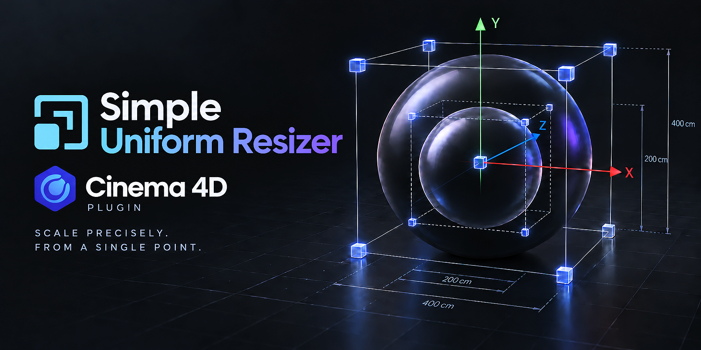

# Simple Uniform Resizer



**Simple Uniform Resizer** is a Cinema 4D plugin for resizing objects,
hierarchies, and selected editable components to exact dimensions while
preserving existing object Scale values.

## History

The project was inspired by
[Uniform Resizer](https://github.com/Valkaari/Uniform-resizer) by Valkaari, a
useful free plugin created for older Cinema 4D versions. The original plugin
has not been updated for current Cinema 4D releases.

Simple Uniform Resizer is an independent implementation written from scratch
for modern Cinema 4D. It is not a port or fork and does not contain source code
from the original project. It keeps the convenient one-axis workflow while
adding hierarchy-aware sizing, native handling of parametric objects and
generators, axis controls, selectable pivot modes, and component resizing.

## What It Does

Cinema 4D can already resize many object types correctly through its native
Scale Tool, but entering an exact final size while keeping all dimensions
proportional is less direct. Simple Uniform Resizer provides that workflow in a
compact dialog:

- Displays the real X, Y and Z dimensions of the current selection in
  centimeters.
- Accepts an exact target size on any enabled axis.
- Applies the same resize factor to all enabled axes.
- Preserves existing object Scale values; an object at `1, 1, 1` remains at
  `1, 1, 1`.
- Supports polygon meshes, editable splines, parametric objects, generators,
  and hierarchies through Cinema 4D's native scaling behavior.
- Supports both a single hierarchy root and multiple independently selected
  objects.
- Resizes selected points, edges, or polygons on one editable object without
  changing the object's transform Scale.
- Provides three persistent pivot modes and two temporary keyboard overrides.
- Creates one normal Cinema 4D Undo step for each resize operation.

## Compatibility

- Tested with **Cinema 4D 2026.3.4** on **Windows 11**.
- Other Cinema 4D versions and operating systems have not yet been verified.

The distributed `.pypv` file is protected Cinema 4D Python code. A separate
build may be required when Cinema 4D changes its embedded Python version.

## Installation

1. Download the latest ZIP archive from
   [Releases](../../releases/latest).

2. Extract the complete `Simple Uniform Resizer` folder into a Cinema 4D
   plugin directory.

3. Keep the folder structure unchanged:
   
   ```text
   Simple Uniform Resizer/
   ├── simple_uniform_resizer.pypv
   └── icons/
       └── simple_uniform_resizer.png
   ```

4. Restart Cinema 4D.

5. Open the command through the Extensions menu or search for
   `Simple Uniform Resizer` with Cinema 4D's Commander (`Shift+C`). The command
   can also be added to a custom palette or layout.

To locate your user plugin directory, open Cinema 4D Preferences, use
**Open Preferences Folder**, and create a `plugins` folder there if it does not
already exist. A custom plugin path can also be added in Cinema 4D Preferences.

## Object and Hierarchy Resizing

1. Select one object, a hierarchy root, or several independent objects.
2. Open **Simple Uniform Resizer**.
3. Enable the axes that should participate in the resize.
4. Enter the required final dimension in any enabled X, Y, or Z field.
5. Press **Enter**.

The entered axis determines the resize factor:

```text
resize factor = target dimension / current dimension
```

That factor is applied to every enabled axis. The displayed dimensions are
updated after Cinema 4D finishes evaluating the scene.

## Component Resizing

Component resizing is selected automatically from Cinema 4D's current editing
mode; no additional switch is required.

1. Select exactly one editable point object.
2. Enter Point, Edge, or Polygon mode.
3. Select the components to resize.
4. Enter an exact target dimension in an enabled X, Y, or Z field.
5. Press **Enter**.

Only the selected geometry is resized. The object's Position, Rotation, Scale,
and Frozen Scale values are not replaced. Edge and polygon selections are
converted to their unique participating points. On editable Bézier splines,
the tangents belonging to selected points are transformed together with those
points.

Component resizing currently supports one editable object at a time.
Parametric objects and generators must first be made editable when their
components need to be resized.

## Axis Checkboxes

Each dimension has its own checkbox:

- **Checked:** the axis participates in the resize.
- **Unchecked:** geometry and object positions are constrained on that axis.

With X, Y, and Z enabled, the selection is resized uniformly.

For object and hierarchy resizing, the axis mask intentionally follows Cinema
4D's native Scale Tool behavior. Polygon meshes follow the enabled axes
directly. Parametric objects and generators can remain proportional on all
axes because Cinema 4D changes their native size parameters uniformly.

For component resizing, the mask is applied directly to the selected points in
the active operation frame. Disabled axes remain unchanged.

## Pivot Modes

Pivot modes define the point around which the resize is performed.

### Cinema 4D Axis

For one object or hierarchy, this uses the selected object's native axis. For
multiple independently selected objects, it uses Cinema 4D's native helper
axis at the center of the selected object axes, matching the Scale Tool gizmo.

In Point, Edge, or Polygon mode, it uses Cinema 4D's current Modeling Axis.

### Size+ Center

Uses the center of the measured bounding box. This also works for a single
object or hierarchy whose real object axis is offset from its visible bounds.
In component mode, it uses the center of the selected component bounds.

### First Selected

Uses the object axis of the first top-level object in the selection order. For
a single selection or component operation, this is the selected object's own
axis.

### Temporary Pivot Shortcuts

The selected persistent pivot mode can be overridden for one operation:

- **Ctrl+Enter — Bottom Center:** uses the bottom center of the currently
  measured object, hierarchy, multi-selection, or component bounds.
- **Shift+Enter — Scene Origin:** uses the world origin at `0, 0, 0` while
  preserving the current operation-axis orientation.

Pressing Ctrl and Shift together is intentionally rejected to avoid an
ambiguous operation.

## Hierarchies and Selection

- Selecting a Null or another hierarchy root includes its descendants in the
  displayed dimensions and resize operation.
- If both a parent and one of its descendants are selected, the descendant is
  not processed a second time.
- With multiple independent objects selected, their positions are adjusted
  around the chosen pivot so the selection behaves as one group.
- Existing object Scale and Frozen Scale values are preserved rather than
  reset or replaced.

## Rigged Objects and Complex Dependencies

The plugin does not block or special-case rigged objects. Uniform resizing with
X, Y, and Z enabled can work correctly, but exact results are not guaranteed for
hierarchies that contain rigging or dependency systems such as Joint objects,
Weight tags, Constraint tags, XPresso, Pose Morph, or similar setups.

Partial-axis resizing is especially likely to produce unexpected deformation,
offsets, or objects moving out of alignment because different parts of a rig
can evaluate scaling in different ways. Carefully inspect the result, change
frames to force the rig to re-evaluate, and use Undo immediately if anything
looks incorrect. Selecting the common parent Null is generally the safest
choice for a complete rig.

## Notes and Limitations

- A selection with zero size on the edited axis cannot be resized from that
  axis. Enter the target through an axis with a non-zero current size.
- Component resizing requires selected components on exactly one editable
  point object.
- Save important scenes before using any tool that modifies complex rigs or
  generator hierarchies.
- If Cinema 4D reports an unexpected result, undo the operation and check the
  Console for a warning from Simple Uniform Resizer.
- The plugin does not use background timers. Its dialog refreshes in response
  to Cinema 4D scene-change messages.

## Version History

### 1.1.0

- Added exact resizing of selected points, edges, and polygons.
- Added automatic component-mode detection for one editable object.
- Added `Ctrl+Enter` Bottom Center pivot override.
- Added `Shift+Enter` Scene Origin pivot override.
- Added Bézier tangent handling for selected spline points.
- Changed the plugin icon asset from `.tif` to `.png`.

### 1.0.0

- Initial public release with exact object and hierarchy resizing, axis masks,
  three pivot modes, native generator handling, and Scale preservation.

## Acknowledgements

Concept inspired by
[Uniform Resizer](https://github.com/Valkaari/Uniform-resizer) by Valkaari.

## Copyright and License

Copyright © 2026 VitalS. All rights reserved.

The plugin is provided free of charge for use in personal and commercial
Cinema 4D projects. Redistribution, modification, resale, or repackaging of the
plugin without prior permission is not allowed.

The plugin is provided **as is** and is used entirely at your own risk, without
warranty of any kind. The author is not responsible for data loss, damaged
scenes, broken rigs, or any other direct or indirect damages resulting from its
use. No customer service, technical support, maintenance, compatibility fixes,
or future updates are guaranteed.
